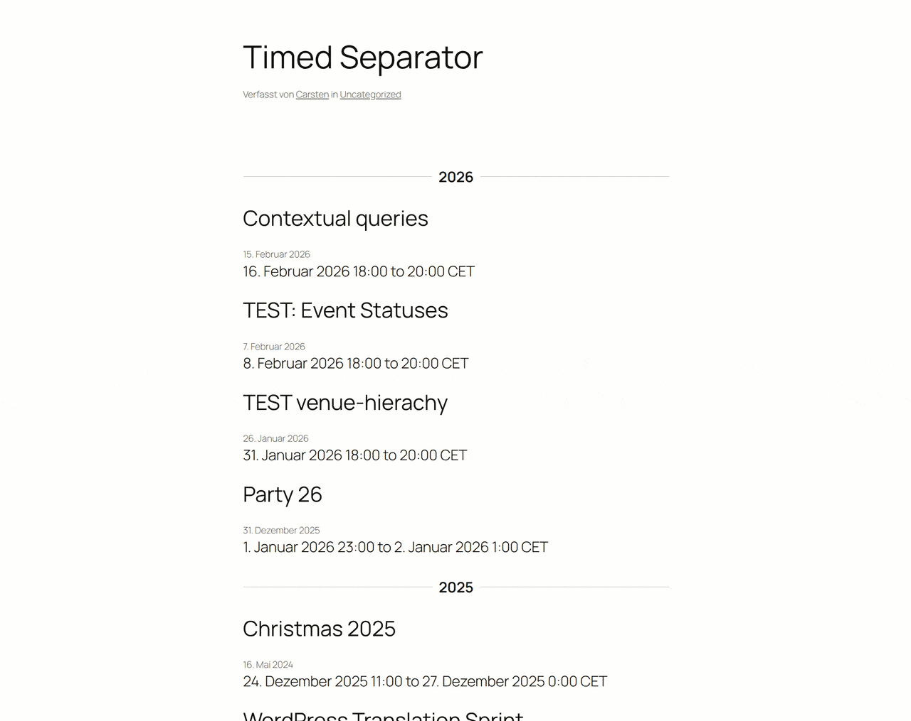

# GatherPress Timed Separator

**Contributors:** carstenbach & WordPress Telex  
**Tags:** block, time-based, visual separator, events  
**Tested up to:** 6.9  
**Stable tag:** 0.1.0  
**License:** GPLv2 or later  
**License URI:** https://www.gnu.org/licenses/gpl-2.0.html  

[](https://playground.wordpress.net/?blueprint-url=https://raw.githubusercontent.com/carstingaxion/gatherpress-timed-separator/main/.wordpress-org/blueprints/blueprint.json) [](https://github.com/carstingaxion/gatherpress-timed-separator/actions/workflows/build-test-measure.yml)

A dynamic separator block for WordPress that displays date-boundary labels between event posts inside [GatherPress](https://gatherpress.org/) query loops.



## Description

GatherPress Timed Separator is a WordPress block designed to be placed inside a `core/post-template` block within a `core/query` that queries `gatherpress_event` posts. It renders a visible date-boundary separator label between events based on a configurable interval.

When the date boundary changes between consecutive events, the separator renders a formatted label. Duplicate labels for events in the same period are automatically hidden.

### Interval Options

| Interval | Example Output |
|----------|----------------------------------------------|
| **Day** | Tuesday, April 29, 2026 |
| **Week** | Week of Apr 27 – May 3, 2026 |
| **Month** | April 2026 |
| **Year** | 2026 |

### How It Works

1. Insert a `core/query` block configured to query `gatherpress_event` posts.
2. Inside the **Post Template** (child of the query loop), place the **GatherPress Timed Separator** block above or between your event blocks.
3. Choose an interval (day, week, month, or year) from the block's sidebar settings.
4. On the frontend, the block examines each post's event datetime metadata and renders a formatted label only when a date boundary is crossed.

### Editor Preview

The block provides a live preview in the editor that reacts to the actual queried posts — labels update instantly when the interval is changed. Separator instances that would be hidden on the frontend (duplicates) are visually dimmed in the editor.

## Requirements

- WordPress 6.4 or later
- PHP 7.4 or later
- [GatherPress](https://gatherpress.org/) plugin (active)

## Installation

1. Upload the plugin files to `/wp-content/plugins/gatherpress-timed-separator`, or install through the WordPress plugin installer.
2. Activate the plugin via the **Plugins** screen.
3. Ensure GatherPress is installed and active.
4. Add a **Query Loop** block querying `gatherpress_event` posts and insert the separator block within the post template.

## Development

```bash
# Install dependencies
npm install

# Start development build with watch mode
npm start

# Production build
npm run build

# Lint JavaScript
npm run lint:js

# Lint CSS
npm run lint:css

# Create plugin ZIP
npm run plugin-zip
```

## Frequently Asked Questions

### Does this block work without GatherPress?

The block is designed specifically for GatherPress event posts. It reads event datetime metadata stored by GatherPress. Without GatherPress, it falls back to the post's published date.

### Can I style the separator?

Yes. The block outputs BEM-classed HTML elements that you can target with custom CSS. The main wrapper uses `.gatherpress-timed-separator` as the root class.

The block also supports the following WordPress block editor features:

- Wide and full alignment
- Background, text, and gradient colors
- Typography (font size, line height, font family, font weight, text transform)
- Spacing (margin and padding)
- Shadows
- Borders (color, radius, style, width)

### Can I use this outside a Query Loop?

No. The block is restricted to `core/post-template` (the ancestor constraint is enforced in `block.json`). It requires the post context provided by the query loop to determine event dates.

## Changelog

### 0.1.0

- Initial release.

## License

This plugin is licensed under the [GPLv2 or later](https://www.gnu.org/licenses/gpl-2.0.html).
